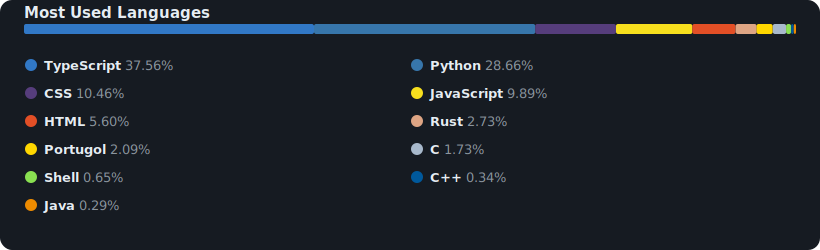

# Hi, I'm Luís Felipe Farias Nunes
**SOFTWARE DEVELOPER (REACT · NODE · TYPESCRIPT · RUST) | CONTABILIDADE & MBA EM FINANÇAS | DATA ANALYTICS**

---

### About:

Busco atuar como Desenvolvedor Junior ou Analista de Sistemas aplicando meu domínio em TypeScript, React e Node.js. Como diferencial, uno meu diploma em Contabilidade e MBA em Finanças à experiência em gestão de produtos digitais e análise de dados. Meu foco é traduzir regras de negócios em softwares eficientes e escaláveis, desenvolvendo soluções orientadas ao usuário e gerando vantagem competitiva para a empresa.

- Studying Analysis and Development of Systems at **Cesar School**
- Currently learning: **C and Java**

---

### Connect with me:

  
  

---

### Languages and Tools:
#### Programming Languages & Back-end

  
  
  
  
  
  
  
  

#### Front-end & Design

  
  
  
  
  
  
  
  
  
  

#### Database, Infrastructure & Tools

  
  
  
  
  
  
  
  

---

### Education

* BTech in **Analysis and Systems Development** – **CESAR School** (2025 – 2027)
* Specialization in **Intelligent Management of Distance Learning** – **UNIFAEL** (2026)
* Specialization in **Distance Learning with a Focus on Methodologies** – **UNAMA** (2023)
* MBA in **Financial Management, Controllership, and Auditing** – **Faculdade UniBF** (2022)
* Bachelor’s Degree in **Accounting** – **Faculdade ESUDA** (2016 – 2020)
* Technical Degree in **Real Estate Transactions** – **Escola Técnica Mônaco** (2021)

---

### Most Used Languages:

  

